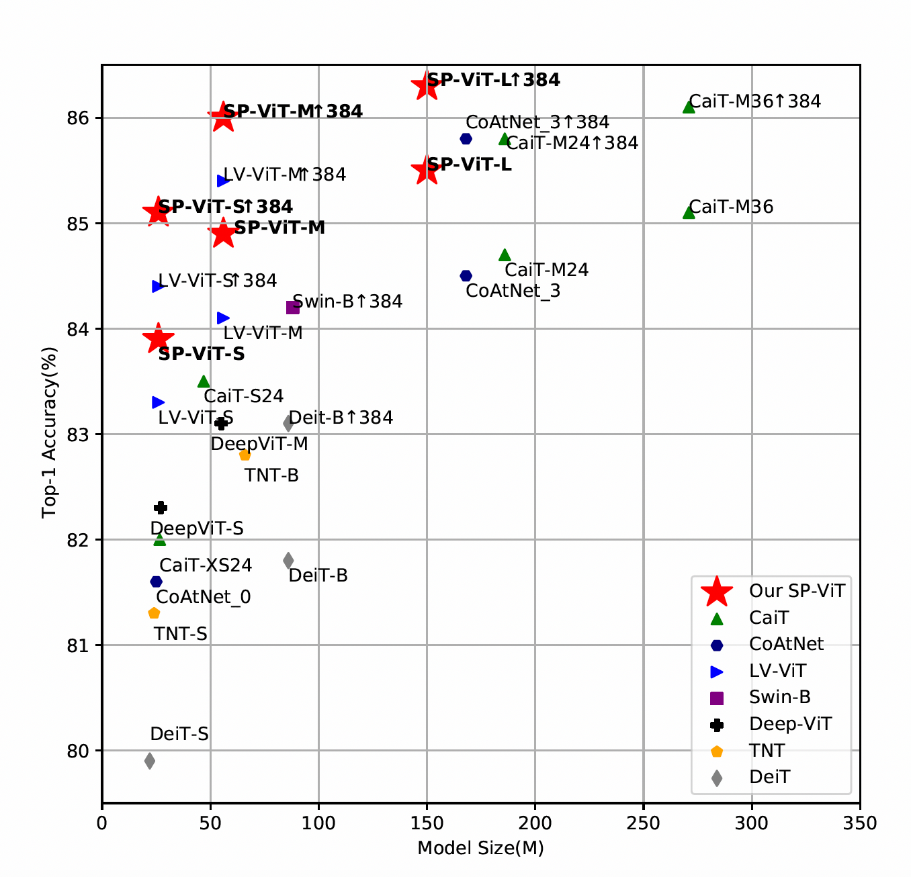

# SP-ViT
This is the official implementation of our paper [SP-ViT: Learning 2D Spatial Priors for Vision Transformers.](https://arxiv.org/pdf/2206.07662.pdf)

# Code will be published soon!
# All Tokens Matter: Token Labeling for Training Better Vision Transformers ([arxiv](https://arxiv.org/abs/2104.10858))

This is a Pytorch implementation of our paper. 



Comparison between our proposed SP-ViT and state-of-the-art vision transformers. Note that we exclude models pretrained on extra data or larger
resolution than 224 × 224 for a fair comparison.

Our implementation is based on the [TokenLabeling](https://github.com/zihangJiang/TokenLabeling) and [pytorch-image-models](https://github.com/rwightman/pytorch-image-models).

#### SP-ViT Models(Using [TokenLabeling](https://github.com/zihangJiang/TokenLabeling) as baseline)

| Model                           | layer | dim  | Image resolution |  Param  | Top 1 |Download |
| :------------------------------ | :---- | :--- | :--------------: |-------: | ----: |   ----: |
| SP-ViT-S                        | 16    | 384  |       224        |  26M |  83.9 |[link]
(https://github.com/ZhouYuxuanYX/SP-ViT/releases/download/1.0/) |
| SP-ViT-S                        | 16    | 384  |       384        |  26M |  85.1 |[link]
(https://github.com/ZhouYuxuanYX/SP-ViT/releases/download/1.0/) |
| SP-ViT-M                        | 20    | 512  |       224        |  56M |  84.9 |[link]
(https://github.com/ZhouYuxuanYX/SP-ViT/releases/download/1.0/) |
| SP-ViT-M                        | 20    | 512  |       384        |  56M |  86.0 |[link]
(https://github.com/ZhouYuxuanYX/SP-ViT/releases/download/1.0/) |
| SP-ViT-L                        | 24    | 768  |       224        | 150M |  85.5 |[link]
(https://github.com/ZhouYuxuanYX/SP-ViT/releases/download/1.0/) |
| SP-ViT-L                        | 24    | 768  |       384        | 150M |  86.3 |[link]
(https://github.com/ZhouYuxuanYX/SP-ViT/releases/download/1.0/) |

#### Requirements
pyyaml
scipy
timm==0.4.5

data prepare: ImageNet with the following folder structure, you can extract imagenet by this [script](https://gist.github.com/BIGBALLON/8a71d225eff18d88e469e6ea9b39cef4).

```
│imagenet/
├──train/
│  ├── n01440764
│  │   ├── n01440764_10026.JPEG
│  │   ├── n01440764_10027.JPEG
│  │   ├── ......
│  ├── ......
├──val/
│  ├── n01440764
│  │   ├── ILSVRC2012_val_00000293.JPEG
│  │   ├── ILSVRC2012_val_00002138.JPEG
│  │   ├── ......
│  ├── ......
```

#### Validation
Replace DATA_DIR with your imagenet validation set path and MODEL_DIR with the checkpoint path
```
CUDA_VISIBLE_DEVICES=0 bash eval.sh /path/to/imagenet/val /path/to/checkpoint
```

#### Label data

Please go to [TokenLabeling](https://github.com/zihangJiang/TokenLabeling) for downloading the token label data.

#### Training

Train SP-ViT: 

```
bash distributed_train.sh
```

#### Fine-tuning

To Fine-tune the pre-trained SP-ViT on images with 384x384 resolution:
```
bash distributed_fine_tune.sh
```

### Segmentation

Please refer to [TokenLabeling](https://github.com/zihangJiang/TokenLabeling) for more details:

| Backbone                        | Method  | Crop size | Lr Schd |  mIoU   |  mIoU(ms) | Pixel Acc.| Param |
| :------------------------------ | :------ | :-------- | :------ |:------- |:--------- | :-------- | :---- |
| LV-ViT-S                        | UperNet |  512x512  |   160k  |  47.9   |    48.6   |   83.1    |  44M  |
| SP-ViT-S                        | UperNet |  512x512  |   160k  |  49.0   |    49.8   |   83.4    |  44M  |


### Visualization

We apply the visualization method [Transformer-Explainability] (https://github.com/hila-chefer/Transformer-Explainability) to visualize the parts of the image that led to a certain classification for DeiT-S and our SP-ViT-S (w/o TokenLabeling). The parts of the image that used by the network to make the decision are highlighted in red.


### Label generation
To generate token label data for training:
```bash
python3 generate_label.py /path/to/imagenet/train /path/to/save/label_top5_train_nfnet --model dm_nfnet_f6 --pretrained --img-size 576 -b 32 --crop-pct 1.0
```

#### Reference
If you use this repo or find it useful, please consider citing:
```
@inproceedings{BMVC2022,
  author={Zhou, Yuxuan and Xiang, Wangmeng and Li, Chao and Wang, Biao and Wei, Xihan and Zhang, Lei and Keuper, Margret and Hua, Xiansheng},
 booktitle = {The 33rd British Machine Vision Conference},
 title = {SP-ViT: Learning 2D Spatial Priors for Vision Transformers},
 url = {https://bmvc2022.mpi-inf.mpg.de/0564.pdf},
 year = {2022}
}
```

#### Related projects
[MMSegmentation](https://github.com/open-mmlab/mmsegmentation), [Transformer Explainability](https://github.com/hila-chefer/Transformer-Explainability).

